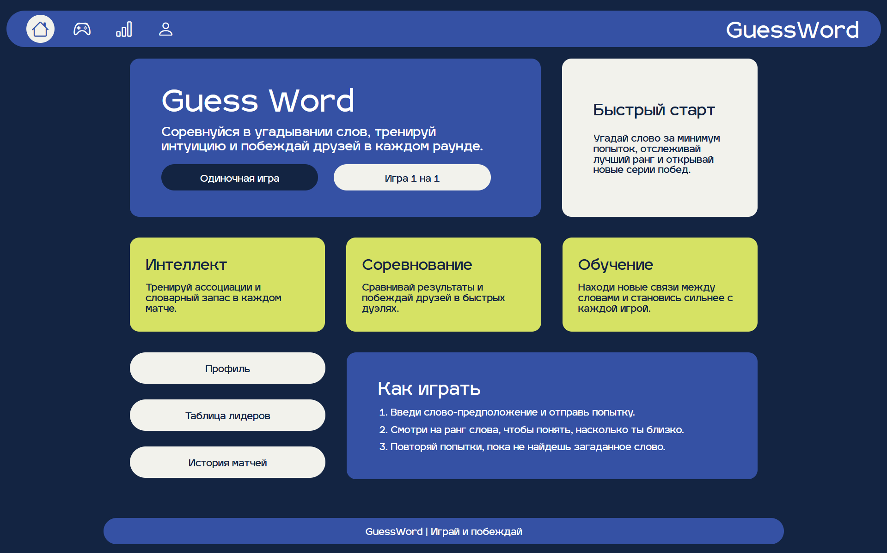
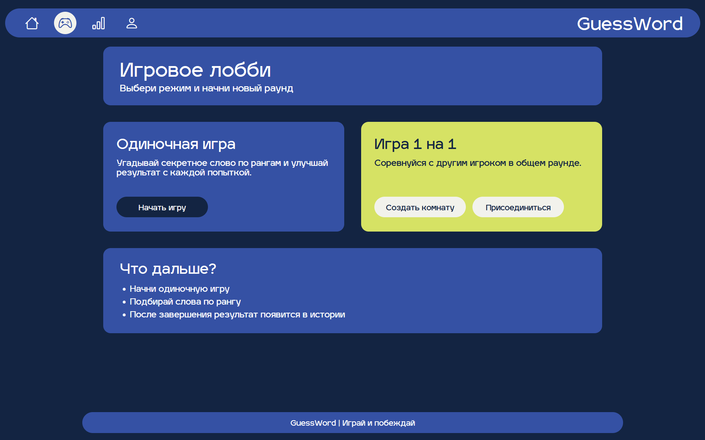
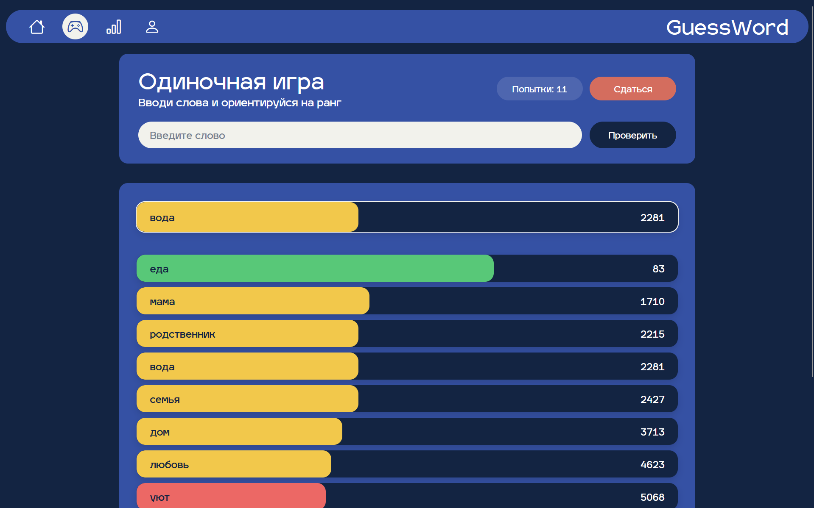
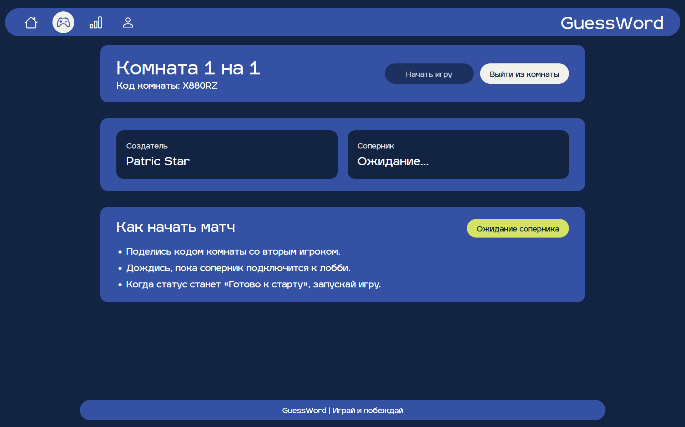
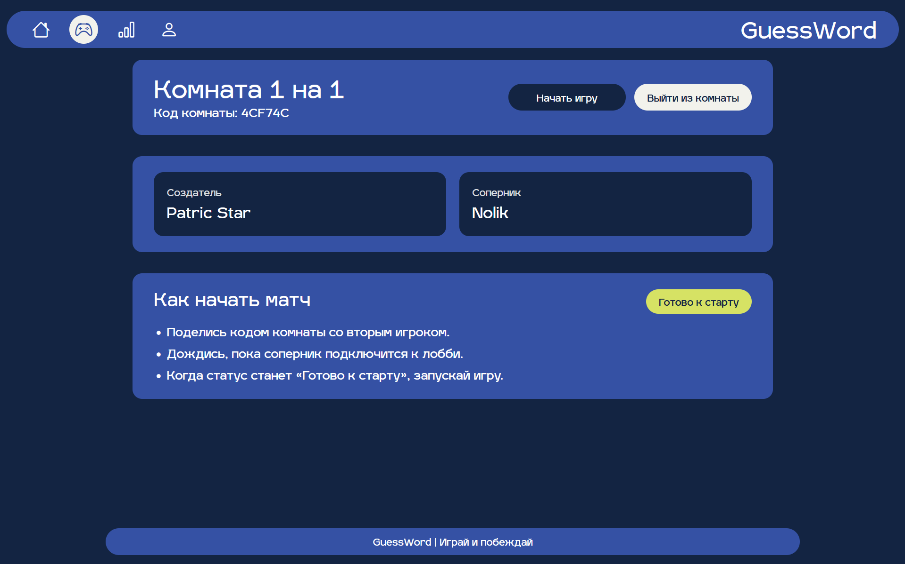
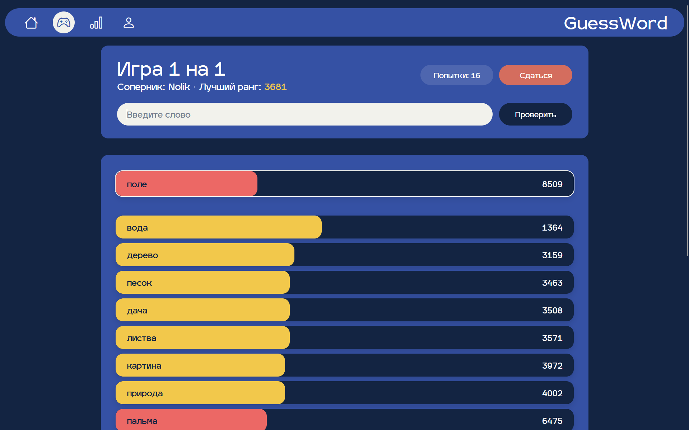
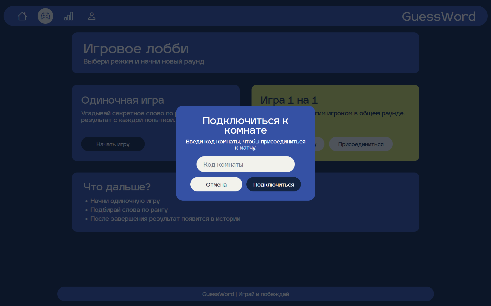
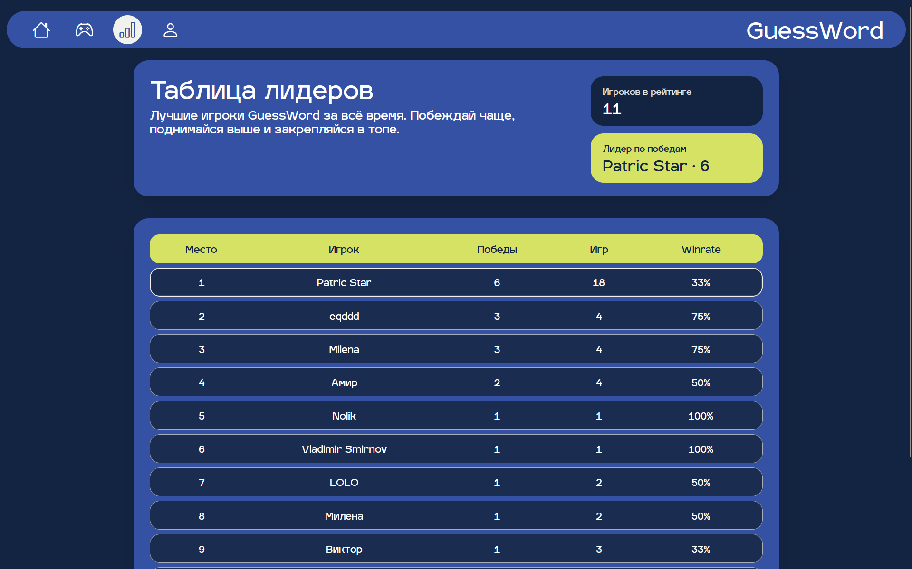
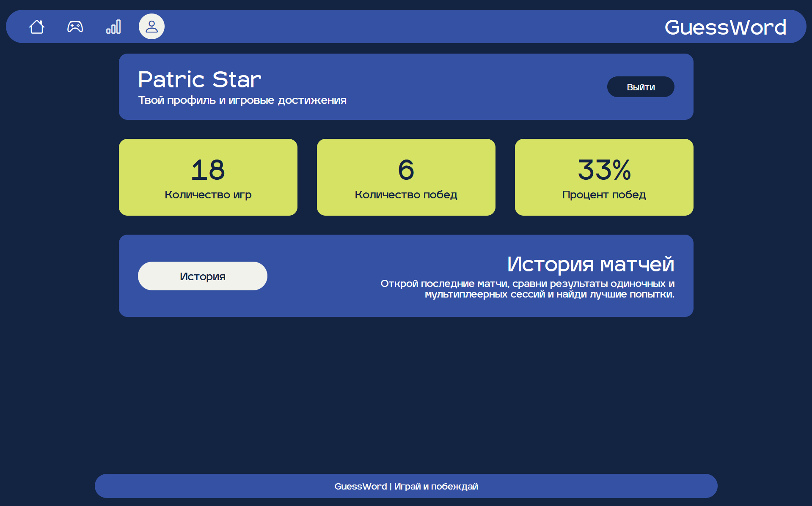

# GuessWord

**GuessWord** — учебное fullstack веб-приложение для угадывания слов. Пользователь вводит слова, а приложение показывает, насколько они близки к загаданному слову по смыслу. Близость считается на сервере через векторные представления слов и косинусную похожесть.

Проект сделан как практическая работа по backend- и fullstack-разработке на .NET: здесь есть ASP.NET Core Web API, Blazor WebAssembly, PostgreSQL с `pgvector`, JWT-аутентификация, SignalR для real-time режима и Docker-инфраструктура. Docker Compose используется для запуска PostgreSQL, API и nginx, который раздаёт Blazor WebAssembly клиент и проксирует запросы к backend.

## Статус проекта

Учебный / портфолио-проект. Основной игровой сценарий реализован и может использоваться как демонстрация навыков начинающего .NET/backend-разработчика.

Реализовано:

- одиночная игра;
- многопользовательская игра через комнаты;
- регистрация и авторизация по JWT;
- история игр, профиль и таблица лидеров;
- хранение данных в PostgreSQL;
- импорт словаря и embeddings в базу данных;
- Docker Compose для запуска PostgreSQL, API и nginx.

Ограничения:

- автоматические тесты не добавлены;
- CI/CD не настроен;
- production-деплой не настроен.

## Скриншоты

### Главная страница



### Игровое лобби



### Одиночная игра



### Комната: ожидание соперника



### Комната: готовность к старту



### Многопользовательская игра



### Подключение к комнате



### Таблица лидеров



### Профиль игрока



## Основной функционал

- Регистрация и авторизация пользователей.
- JWT-аутентификация для защищенных API-методов.
- Одиночная игра с сохранением активной партии.
- Многопользовательский режим 1 на 1 через комнаты.
- Real-time обновления комнаты и игры через SignalR.
- Проверка введенного слова по словарю.
- Ранжирование попыток по близости к загаданному слову.
- Обработка повторных и несуществующих слов.
- Возможность сдаться и завершить игру.
- История завершенных игр.
- Профиль пользователя и таблица лидеров.
- Импорт словаря и embeddings при старте API.

## Технологии

- **C# / .NET 8**
- **ASP.NET Core Web API**
- **Blazor WebAssembly**
- **Entity Framework Core**
- **PostgreSQL**
- **pgvector**
- **SignalR**
- **JWT Bearer Authentication**
- **Docker / Docker Compose**
- **nginx**
- **Python** для вспомогательных скриптов подготовки словарей

## API

В режиме разработки API документируется через Swagger:

```bash
http://localhost:5280/swagger
```

Основные группы API:

- `api/user` — регистрация, вход, профиль пользователя и таблица лидеров;
- `api/game` — запуск игры, отправка попыток, активная игра и история;
- `api/games` — получение состояния многопользовательской игры и завершение игры;
- `api/room` — создание комнаты, подключение к комнате, получение состояния комнаты и выход;
- `api/dictionary` — проверка словаря и получение случайного секретного слова;
- `/hubs/game` — SignalR hub для обновлений комнаты и игры в реальном времени.

## Архитектура проекта

Проект разделен на несколько частей:

- **GuessWord.Api** — backend на ASP.NET Core Web API. Отвечает за пользователей, авторизацию, игры, комнаты, историю, таблицу лидеров, импорт словаря и расчет рангов.
- **GuessWord.Client** — frontend на Blazor WebAssembly. Содержит страницы приложения, UI-компоненты и клиентские сервисы для работы с API и SignalR.
- **GuessWord.Shared** — общие DTO и enum-типы, которые используются клиентом и сервером.
- **PostgreSQL + pgvector** — хранение пользователей, игр, комнат, попыток, словаря и embeddings.
- **SignalR Hub** — канал real-time обновлений для комнат и многопользовательской игры.
- **scripts** — Python-скрипты для подготовки и обслуживания словарных данных.
- **deploy** — конфигурация nginx и SQL-инициализация расширения `vector`.

Упрощенная схема:

```text
Blazor WebAssembly
        |
        | HTTP / SignalR
        v
ASP.NET Core Web API
        |
        | EF Core + pgvector
        v
PostgreSQL
```

## Установка и запуск

### Требования

- .NET SDK 8
- PostgreSQL 16
- Расширение `pgvector`
- Docker и Docker Compose, если используется контейнерный запуск
- Python 3, если нужно заново готовить словари через скрипты

### Клонирование репозитория

```bash
git clone https://github.com/elon1te9/GuessWord.git
cd GuessWord
```

### Локальная конфигурация API

Для локальной разработки удобно создать файл `GuessWord.Api/appsettings.Development.json`. Он исключен из Git через `.gitignore`, поэтому в него можно вынести локальные настройки подключения и JWT-ключ.

```json
{
  "ConnectionStrings": {
    "DefaultConnection": "Host=localhost;Port=5432;Database=guessword_db;Username=postgres;Password=your_password"
  },
  "Dictionary": {
    "SociationVecPath": "Resources/Data/sociation2vec800.vec"
  },
  "Jwt": {
    "Key": "replace_with_long_local_secret_key"
  }
}
```

### Применение миграций

API применяет EF Core миграции при старте приложения. При необходимости миграции можно применить вручную:

```bash
dotnet ef database update --project GuessWord.Api
```

### Запуск API

```bash
dotnet run --project GuessWord.Api
```

По настройкам из `launchSettings.json` API запускается на:

```bash
http://localhost:5280
```

В режиме разработки Swagger доступен по адресу:

```bash
http://localhost:5280/swagger
```

### Запуск клиента

```bash
dotnet run --project GuessWord.Client
```

По настройкам из `launchSettings.json` клиент запускается на:

```bash
http://localhost:5101
```

Важно: текущая клиентская часть отправляет запросы к API по тому же origin, с которого открыт Blazor-клиент. Для полноценного локального запуска frontend + backend удобнее использовать nginx-проксирование из Docker-сценария или отдельно настроить `BaseUrl`/прокси для разработки.

## Запуск через Docker

В репозитории есть `Dockerfile`, `docker-compose.server.yml`, конфигурация nginx и пример переменных окружения `.env.example`.

### Подготовка `.env`

```bash
cp .env.example .env
```

Пример содержимого:

```env
POSTGRES_DB=guessword_db
POSTGRES_USER=guessword
POSTGRES_PASSWORD=change_me_strong_password
JWT_KEY=change_me_to_a_long_random_secret_key
```

### Публикация клиентской части для nginx

`docker-compose.server.yml` монтирует статические файлы клиента из `publish/client/wwwroot`, поэтому перед запуском compose нужно опубликовать Blazor WebAssembly:

```bash
dotnet publish GuessWord.Client/GuessWord.Client.csproj -c Release -o publish/client
```

### Запуск контейнеров

```bash
docker compose -f docker-compose.server.yml up --build
```

После запуска nginx слушает порт `80`:

```bash
http://localhost
```

Состав Docker-сценария:

- `db` — PostgreSQL с образом `pgvector/pgvector:pg16-bookworm`;
- `api` — ASP.NET Core API;
- `nginx` — раздача Blazor-клиента и проксирование `/api` и `/hubs`.

## Структура проекта

```text
GuessWord/
├── GuessWord.Api/                 # ASP.NET Core Web API
│   ├── Controllers/               # HTTP API
│   ├── Data/                      # EF Core DbContext
│   ├── Hubs/                      # SignalR Hub
│   ├── Interfaces/                # Интерфейсы сервисов
│   ├── Migrations/                # EF Core миграции
│   ├── Models/                    # Сущности базы данных
│   ├── Resources/                 # Словари all-words и secret-words
│   └── Services/                  # Бизнес-логика
├── GuessWord.Client/              # Blazor WebAssembly клиент
│   ├── Components/                # UI-компоненты
│   ├── Layout/                    # Layout и навигация
│   ├── Pages/                     # Страницы приложения
│   ├── Services/                  # Клиентские сервисы API/SignalR/localStorage
│   └── wwwroot/                   # Статика, стили, шрифты
├── GuessWord.Shared/              # Общие DTO и enum-типы
├── deploy/                        # nginx и SQL init для pgvector
├── documentation/                 # Документы и скриншоты
├── scripts/                       # Python-скрипты для словарей
├── docker-compose.server.yml      # Docker Compose конфигурация
├── Dockerfile                     # Сборка API
└── .env.example                   # Пример переменных окружения
```

## Игровая логика

1. При старте игры сервер выбирает секретное слово из словаря слов, которые могут быть загаданными.
2. Пользователь вводит слово-попытку.
3. Сервер нормализует ввод и проверяет, есть ли такое слово в таблице `Words`.
4. Если слово существует, сервер получает его ранг относительно секретного слова.
5. Ранг строится на основе косинусной похожести между embedding секретного слова и embedding слова-попытки.
6. Чем меньше ранг, тем ближе слово к загаданному.
7. Если пользователь вводит само секретное слово, игра завершается победой.
8. Для многопользовательской игры состояние синхронизируется между игроками через SignalR.

Ранги кешируются в памяти на несколько часов, чтобы не пересчитывать близость для одного и того же секретного слова при каждой попытке.

## Что я изучил в процессе

- Проектирование backend-части на ASP.NET Core Web API.
- Разделение приложения на API, клиент и общий слой DTO.
- Работу с Entity Framework Core, миграциями и связями между сущностями.
- Использование PostgreSQL и `pgvector` для хранения векторных представлений слов.
- Реализацию JWT-аутентификации.
- Интеграцию SignalR для real-time сценариев.
- Создание Blazor WebAssembly клиента и взаимодействие с API.
- Контейнеризацию backend-инфраструктуры через Docker Compose.
- Подготовку словарных данных с помощью Python-скриптов.

## Возможные улучшения

- Добавить автоматические тесты для сервисов и API.
- Настроить CI для сборки и проверки проекта.
- Вынести конфигурацию API URL для Blazor-клиента в отдельные настройки.
- Улучшить обработку ошибок и сообщения валидации на клиенте.
- Добавить refresh token или другой механизм продления сессии.
- Добавить больше игровых режимов и фильтров статистики.
- Добавить seed/demo-данные для быстрого локального знакомства с проектом.
- Описать процесс подготовки embeddings более подробно.

## Документация

В репозитории есть папка `documentation`:

- `documentation/КурсоваяСмирнов.pdf` — текстовая документация по проекту;
- `documentation/screenshots/` — скриншоты интерфейса, использованные в README.
